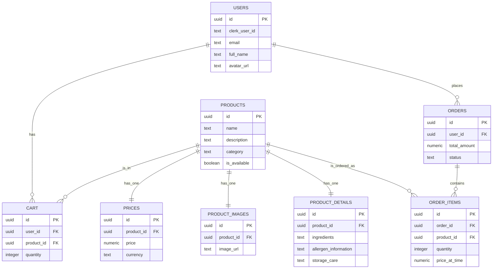

# Database Schema Diagram

Berikut adalah visualisasi hubungan antar tabel dalam database Supabase Anda (`supabsenow.sql`).

## Penjelasan Relasi (Cardinality)

1.  **USERS ↔ ORDERS (1:N)**

    - Satu **User** bisa punya Banyak **Order** (History belanja).
    - Satu **Order** pasti milik Satu **User**.

2.  **USERS ↔ CART (1:N)**

    - Satu **User** bisa punya Banyak item di **Cart**.

3.  **ORDERS ↔ ORDER_ITEMS (1:N)**

    - Satu **Order** (Bon) terdiri dari Banyak **Order Items** (Rincian barang).

4.  **PRODUCTS ↔ PRICES / DETAILS / IMAGES (1:1)**

    - Hubungan ini unik (One-to-One).
    - Setiap **Product** hanya punya SATU harga, SATU detail, dan SATU gambar utama di tabel terpisah.
    - _Catatan: Ini adalah teknik Normalisasi database._

5.  **PRODUCTS ↔ ORDER_ITEMS (1:N)**
    - Satu jenis **Product** bisa muncul di Banyak **Order Items** (dibeli oleh banyak orang berbeda).
